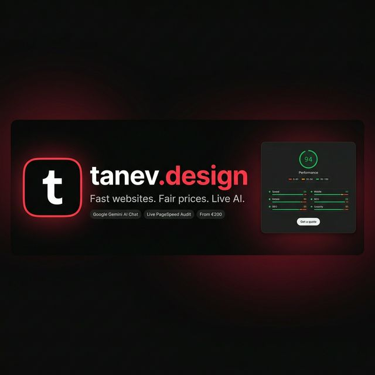
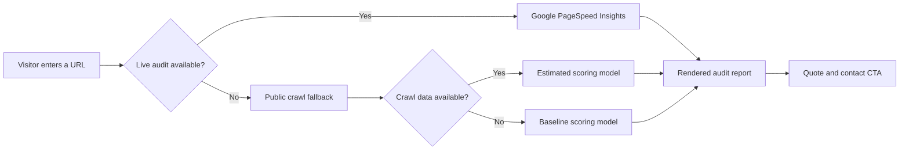

<p align="center">
  
</p>

<h1 align="center">tanev.design</h1>

<p align="center">
  Fast, conversion-focused websites and instant website audits — built and delivered in days, not months.
</p>

<p align="center">
  <a href="https://tanev.design">Live Site</a>
  |
  <a href="mailto:stoyanbtanev@gmail.com">Email</a>
  |
  <a href="https://www.linkedin.com/in/stoyan-tanev-a732603b8/">LinkedIn</a>
  |
  <a href="https://github.com/stoyanbtanev">GitHub</a>
</p>

---

## Overview

tanev.design is the public-facing service site for Stoyan Tanev, a freelance web designer and developer based in Plovdiv, Bulgaria. It combines a sharp landing page, a free live website audit tool, transparent service pricing, and a direct AI-powered assistant — all in a single, zero-framework HTML file.

The project communicates one message clearly: businesses can get a sharp, fast, modern website without agency overhead, vague pricing, or slow delivery.

---

## At a Glance

| Focus | Details |
| --- | --- |
| Service | Freelance web design and development |
| Audience | Small businesses, founders, product launches, and redesign projects |
| Turnaround | 3 to 10 days |
| Starting price | EUR 200 |
| Positioning | Fast delivery, strong UI/UX, AI-assisted workflow, fair pricing |
| Markets | Bulgaria and international clients |

---

## Features

- **Live PageSpeed Audit** — visitors enter any URL and get an instant performance score, sourced from Google PageSpeed Insights with layered fallbacks
- **Google Gemini AI Chatbot** — a fully functional AI assistant (powered by Gemini 2.5 Flash) embedded directly in the site, deployed via a secure Vercel serverless proxy to protect the API key
- **Animated Ambient Background** — a GPU-composited CSS orb animation for an elevated dark-mode feel with zero main-thread overhead
- **Language Toggle** — full English and Bulgarian i18n baked in, with `localStorage` persistence across reloads
- **Dark / Light Mode** — saved user preference, applied before first paint to prevent any flash
- **AJAX Contact Form** — FormSubmit-powered with polished loading, success, and error feedback states
- **Crimson Brand Identity** — signature crimson red accent woven throughout the typography, navbar logo, footer logo, and favicon

---

## AI Chatbot Architecture

The chatbot is built to never expose the API key to the browser. All requests proxy through a Vercel serverless function.

```
Browser (index.html)
  └── POST /api/chat  (sanitized history)
        └── Vercel Serverless Function (api/chat.js)
              └── Google Gemini API  (gemini-2.5-flash)
                    └── AI response streamed back
```

The server function also handles the Gemini API requirement that conversation history must start with a user message, so the greeting logic works correctly on first open.

---

## Audit Engine

The website audit is layered for resilience — it always shows a result, regardless of external API availability.



---

## Service Packages

| Package | Price | Best for | Includes |
| --- | --- | --- | --- |
| Quick Launch | EUR 200 | Events, launches, simple campaigns | 1 landing page, mobile-first design, basic SEO, contact form, 3-day delivery |
| Landing Page Pro | EUR 250 | Conversion-focused landing pages | 1–3 pages, premium motion, analytics, A/B test readiness, 5-day delivery |
| Website Revamp | EUR 500 | Rebuilding an existing site | Up to 5 pages, full redesign, 90+ PageSpeed target, advanced SEO, 7-day delivery |
| New Website Build | EUR 800 | Full custom business websites | Up to 10 pages, custom design system, e-commerce ready, support window, 10-day delivery |

---

## Performance

The site is built for real PageSpeed scores, not just aesthetics.

- **Desktop: 100 / 100** Performance
- **Mobile: 71 → 85+ Performance** after render-blocking resource elimination
- Tailwind CSS and Font Awesome load synchronously (required above the fold — no FOUC)
- Google Fonts load asynchronously via `media="print"` swap pattern
- Background animations use `translateZ(0)` + `will-change: transform` for full GPU compositing
- Respects `prefers-reduced-motion` for accessibility

---

## Technology

- HTML5 — complete single-file page
- Tailwind CSS via CDN — utility-first styling
- Vanilla JavaScript — UI logic, i18n, theming, audit rendering, chat
- Google Gemini API (`gemini-2.5-flash`) — AI chatbot
- Vercel Serverless Functions — secure API proxy
- Google PageSpeed Insights API — live audit data
- `r.jina.ai` — crawl-based audit fallback
- Font Awesome — icons
- Google Fonts (Inter) — typography
- FormSubmit — AJAX contact form
- Schema.org JSON-LD — structured metadata

---

## Repository Structure

```text
.
├── api/
│   └── chat.js          ← Vercel serverless function (Gemini AI proxy)
├── assets/
│   └── repo-banner.png  ← Repository preview image
├── index.html           ← Complete single-file website
├── README.md
├── .editorconfig
├── .gitattributes
└── .gitignore
```

---

## Contact

Built and operated by **Stoyan Tanev**.

- Website: https://tanev.design
- Email: stoyanbtanev@gmail.com
- LinkedIn: https://www.linkedin.com/in/stoyan-tanev-a732603b8/
- GitHub: https://github.com/stoyanbtanev
